*AS Project Documentation (Scenario A - Federated Commerce After Acquisitions)*

**Ilker Atik — 123947**

## Table of Contents
- [1. Current-State Architectural Analysis of nopCommerce](#1-current-state-architectural-analysis-of-nopcommerce)
    - [1.1. Architectural Foundations and Initialization Mechanics](#11-architectural-foundations-and-initialization-mechanics)
    - [1.2. Data Persistence and Performance Engineering](#12-data-persistence-and-performance-engineering)
    - [1.3. Extensibility Boundaries and Integration Seams](#13-extensibility-boundaries-and-integration-seams)
    - [1.4. Native Operational Capabilities and Scenario Conflicts (The Multi-Store Constraint)](#14-native-operational-capabilities-and-scenario-conflicts-the-multi-store-constraint)
- [2. Definition of Business and Architectural Drivers](#2-definition-of-business-and-architectural-drivers)
    - [2.1. Strategic Business Imperatives (Enterprise Cohesion vs. Local Autonomy)](#21-strategic-business-imperatives-enterprise-cohesion-vs-local-autonomy)
    - [2.2. Architectural Constraints and Target Quality Attributes](#22-architectural-constraints-and-target-quality-attributes)
- [3. Domain and Bounded Context Modeling](#3-domain-and-bounded-context-modeling)
    - [3.1. Functional Subdomain Decomposition (The Problem Space)](#31-functional-subdomain-decomposition-the-problem-space)
    - [3.2. Bounded Context Definition and System Allocation (The Solution Space)](#32-bounded-context-definition-and-system-allocation-the-solution-space)
    - [3.3. Context Mapping, Integration Dynamics, and Explicit Reliability](#33-context-mapping-integration-dynamics-and-explicit-reliability)
- [4. Quality Attribute Scenarios](#4-quality-attribute-scenarios)
    - [4.1. QA Scenario 1: Fault Containment and System Resilience](#41-qa-scenario-1-fault-containment-and-system-resilience)
    - [4.2. QA Scenario 2: Interoperability and Asynchronous Decoupling](#42-qa-scenario-2-interoperability-and-asynchronous-decoupling)
    - [4.3. QA Scenario 3: Modifiability, Strict Boundaries, and Workload Scalability](#43-qa-scenario-3-modifiability-strict-boundaries-and-workload-scalability)
- [5. Chosen Software Architecture Design Framework](#5-chosen-software-architecture-design-framework)
    - [5.1. Attribute-Driven Design (ADD) Method Selection and Justification](#51-attribute-driven-design-add-method-selection-and-justification)
- [6. Target Architecture](#6-target-architecture)
    - [6.1. Structural Topology and Decentralized Data Ownership](#61-structural-topology-and-decentralized-data-ownership)
    - [6.2. Network Interaction Models (Synchronous vs. Asynchronous)](#62-network-interaction-models-synchronous-vs-asynchronous)
    - [6.3. Cross-Cutting Concerns (IAM, Security Compliance, Observability, and State Management)](#63-cross-cutting-concerns-iam-security-compliance-observability-and-state-management)
- [7. Architectural Decisions (ADRs)](#7-architectural-decisions-adrs)
    - [7.1. ADR 1: Single-Store Deployment Configuration over Native Multi-Store Routing](#71-adr-1-single-store-deployment-configuration-over-native-multi-store-routing)
    - [7.2. ADR 2: Asynchronous Integration via the Application-Level Transactional Outbox Pattern](#72-adr-2-asynchronous-integration-via-the-application-level-transactional-outbox-pattern)
    - [7.3. ADR 3: Centralized Discovery via Meilisearch Asynchronous Materialized Views (Open-Host Service)](#73-adr-3-centralized-discovery-via-meilisearch-asynchronous-materialized-views-open-host-service)
- [8. Diagrams](#8-diagrams)
    - [8.1. Domains](#81-domains)
    - [8.2. Bounded Contexts and Related Modules](#82-bounded-contexts-and-related-modules)
    - [8.3. Modules and Event Driven Communication](#83-modules-and-event-driven-communication)
    - [8.4. Context Map (OHS, PL, and ACL)](#84-context-map-ohs-pl-and-acl)
    - [8.5. Order Flow](#85-order-flow)
    - [8.6. Shared Discovery Flow](#86-shared-discovery-flow)
- [9. Conclusion](#9-conclusion)
- [10. References](#10-references)

## 1. Current-State Architectural Analysis of nopCommerce

### 1.1. Architectural Foundations and Initialization Mechanics
The architectural paradigm governing the nopCommerce ecosystem is structured as a production-grade modular monolith, engineered natively upon the ASP.NET Core framework and targeting the .NET 9 runtime. To guarantee enterprise-level maintainability and fault isolation, the system strictly adheres to the Onion Architecture paradigm. This structural philosophy enforces a strict, unidirectional dependency flow directed inward toward the central domain model, ensuring that core business logic remains entirely decoupled from external frameworks, databases, and presentation mechanisms. The physical codebase is logically segregated into primary projects to preserve the separation of concerns:

- **Nop.Core:** Functioning as the absolute center of the application, this layer encapsulates the fundamental domain entities (e.g., Customer, Order, Product), caching abstractions, and the core event broker infrastructure. It possesses zero dependencies on data access implementations or user interfaces.
- **Nop.Data:** Serving as the persistence layer, this project manages data access, object-relational mapping, and programmatic database migrations.
- **Nop.Services:** Operating as the Business Access Layer (BAL), this project orchestrates complex e-commerce rules, custom pricing models, and transaction lifecycles. It depends strictly on the core and data layers.
- **Nop.Web and Nop.Web.Framework:** The outermost layer hosts the ASP.NET Core MVC application. It manages HTTP request processing, model binding, and view rendering via the Razor View Engine, deliberately delegating heavy computational logic to the underlying services. `Nop.Web.Framework` provides reusable UI components and the `WebStoreContext` required for store resolution.

Cross-layer integration is facilitated by a highly decentralized Dependency Injection (DI) mechanism utilizing Autofac. Rather than utilizing a monolithic startup file, nopCommerce employs the `NopEngine` (implementing the `IEngine` interface) as its application bootstrapper. During runtime initialization, the engine utilizes an `ITypeFinder` to dynamically scan all assemblies within the execution environment, including external plugin directories. It discovers classes implementing the `INopStartup` interface, permitting each isolated layer and module to register its own dependencies via constructor injection (utilizing Singleton, Scoped, or Transient lifecycles). The architecture achieves cross-platform interoperability, enabling deployments across Windows, Linux, and macOS environments, alongside native Docker containerization support.

### 1.2. Data Persistence and Performance Engineering
To achieve high-throughput performance for complex e-commerce queries, nopCommerce utilizes `Linq2DB` as its primary Object-Relational Mapper (ORM), having transitioned away from standard Entity Framework Core to grant engineers fine-grained control over asynchronous SQL execution and optimize performance. Data manipulation is governed by a generic `IRepository<TEntity>` interface, which acts as an abstraction layer facilitating asynchronous CRUD operations.

Database schema creation and structural evolution are managed programmatically via the `FluentMigrator` framework. This code-based approach employs C# classes for version-controlled migrations rather than relying on manual SQL scripts, managing both fundamental table structures and version-specific data transformations during upgrades. To maintain structural stability and prevent database schema bloat during extensive enterprise customizations, the architecture heavily relies on the Generic Attribute pattern. This pattern utilizes a centralized `GenericAttribute` table acting as a key-value repository, enabling the dynamic appending of custom properties to core entities without structurally altering the underlying relational database schema.

To optimize performance and support scalability, the architecture employs a multi-tiered caching strategy driven by an `IStaticCacheManager` abstraction. This infrastructure supports both high-speed local in-memory caching and distributed caching via Redis, which is structurally critical for supporting load-balanced web farm deployments and ensuring a consistent cache state. The system employs "lazy acquisition" within its caching tier to avoid duplicating work across concurrent requests and prevents cache stampedes where multiple requests attempt to regenerate the same expired data simultaneously.

### 1.3. Extensibility Boundaries and Integration Seams
To satisfy the demand for extreme flexibility, nopCommerce is designed around a highly extensible plugin architecture. Plugins act as the primary integration seams, allowing developers to inject custom functionality without altering the core monolithic source code. Extensions are packaged as self-contained C# class libraries located in the `/Plugins` directory. Every plugin must include a `plugin.json` manifest file, providing critical metadata such as the `SystemName`, `Version`, and the `FileName` of the compiled assembly. Developers extend the platform by implementing designated contracts, such as `IPaymentMethod` or `ITaxProvider`. The installation lifecycle triggers an `InstallAsync` method that executes database migrations, and requires restarting the application to reload the `AppDomain` so the `NopEngine` can seamlessly register the new dependencies.

To decouple domain actions from custom extensions, the platform implements an in-process Publisher-Subscriber event-driven architecture driven by the `IEventPublisher` interface. A critical architectural feature is that the generic repository layer is event-aware. Mutation methods automatically broadcast entity lifecycle events—specifically `EntityInsertedEvent<T>`, `EntityUpdatedEvent<T>`, and `EntityDeletedEvent<T>`—whenever the database state mutates. Developers can implement the `IConsumer<T>` interface within custom plugins to passively intercept these state changes. This native event-broadcasting mechanism serves as the optimal architectural conduit for intercepting local state changes and relaying them to external systems asynchronously.

Addressing the requirements of decoupled integrations and headless commerce applications, nopCommerce exposes its backend and frontend functionalities through the official Web API plugin. Built upon the RESTful paradigm and adhering to the OpenAPI 3.0 specification, this API infrastructure manages secure authentication and access delegation utilizing JSON Web Tokens (JWT).

### 1.4. Native Operational Capabilities and Scenario Conflicts (The Multi-Store Constraint)
Natively, nopCommerce supports multi-store operations, a feature capable of running multiple distinct storefronts from a single application pool and a shared relational database. The system resolves the active store context (`WebStoreContext`) dynamically by inspecting the HTTP `HOST` header of incoming requests, thereby filtering catalogs, configurations, and pricing to reflect the designated store.

While highly efficient for centralized deployments, utilizing this shared-database capability directly conflicts with the strict fault-isolation boundaries required in federated, post-acquisition enterprise deployments. The federated scenario constraints explicitly prohibit the use of a "shared database shortcut across extracted boundaries". Relying on the native multi-store feature violates the requirement for strict fault containment, as a resource lock, query failure, or infrastructure degradation in one business unit's operation could precipitate a group-wide operational collapse.

Consequently, the target architecture is structurally pressured to bypass this native multi-store context resolution. It is critical to note that this architectural decision does _not_ entail rewriting or removing the native multi-store source code, which would incur prohibitive technical debt and violate the mandate for a focused evolution. Instead, the bypass is executed at the deployment configuration level. The architecture mandates deploying physically isolated nopCommerce application runtimes and dedicated databases for each autonomous business unit, restricting each deployment to operate as a single-store context. The federation of these brands is subsequently managed entirely at the infrastructure and network routing layer, ensuring true local autonomy and fault resilience without corrupting the monolithic core.

## 2. Definition of Business and Architectural Drivers

The architectural evolution of the nopCommerce ecosystem under "Scenario A: Federated Commerce After Acquisitions" is governed by a rigorous set of strategic imperatives. These drivers are explicitly designed to navigate and resolve the inherent tension between establishing centralized enterprise cohesion and preserving the deep local autonomy of the acquired brands.

### 2.1. Strategic Business Imperatives (Enterprise Cohesion vs. Local Autonomy)

- **Creation of a Shared Digital Foundation (Enterprise Cohesion):** The holding group, which has grown progressively through the acquisition of several specialist brands, must present a unified digital identity to the market. This strategic goal requires the architecture to deliver a shared platform and customer experience spanning at least two federated business units. Specifically, the business demands the capability to aggregate cross-brand data to facilitate centralized product discovery, seamless shared identity mechanisms, and overarching customer relationship management.
- **Preservation of Local Autonomy (Operational Independence):** Despite the strategic push for enterprise integration, the architecture must avoid the critical trap of locking the diverse business units into a single, rigid monolithic model or fragmenting into entirely disconnected platforms. The system must structurally allow each acquired brand to maintain its own distinct catalog logic, custom pricing habits, unique inventory assumptions, and localized Enterprise Resource Planning (ERP) operational rhythms.

### 2.2. Architectural Constraints and Target Quality Attributes
To fulfill these complex business imperatives while maintaining high system reliability, the target architecture is constrained by specific technical drivers and quality attributes dictated by the federated scenario.

- **Strict Service Boundaries and Decentralization:** The architecture must enforce rigid data boundaries and explicitly prohibits the use of a "shared database shortcut across extracted boundaries". To satisfy this mandate, the native multi-store feature of nopCommerce—which relies on a single shared relational database to serve multiple storefronts—must be bypassed. Instead, the architecture necessitates the deployment of physically isolated application runtimes and dedicated databases for each business unit to ensure true structural decentralization.
- **Fault Isolation and Containment (Resilience):** The system must guarantee that a localized failure—such as a degraded dependency, delayed network state, or transaction inconsistency within one unit's backend—does not precipitate a system-wide outage. The architecture must demonstrate "local degradation without group collapse," ensuring that if one brand's localized subsystem (such as an ERP system) fails, the overarching enterprise discovery and browsing experience remains completely insulated and fully functional.
- **Asynchronous Decoupling and Explicit Reliability:** To allow the platform to evolve without cross-unit instability and uncontrolled coupling, direct synchronous network dependencies between business units must be minimized. The architectural guidelines strictly mandate the implementation of at least one asynchronous workflow and an explicit reliability decision—such as the Transactional Outbox pattern, idempotency, or compensating transactions—to safely orchestrate data flows. This drives the need for an event-driven choreography strategy routed through a centralized message broker (Apache Kafka) to distribute catalog updates and order placements via delayed consistency. This structural decision ensures cross-system synchronization while strictly preventing the brittle synchronous coupling that leads to cascading failures across the enterprise.

## 3. Domain and Bounded Context Modeling

The contemporary landscape of enterprise software development has undergone a fundamental shift from technical-centric implementations toward domain-centric architectures. In navigating the complex requirements of the "Federated Commerce After Acquisitions" scenario, the traditional pursuit of a single, unified enterprise data model becomes a severe liability. A "total unification" approach attempting to capture this complexity through a "big ball of mud" database schema is neither feasible nor cost-effective for large-scale, federated systems.

To avoid this architectural drift, the system utilizes Domain-Driven Design (DDD), providing the strategic and tactical framework necessary to decompose monolithic aspirations into manageable, cohesive units of business logic. This paradigm mandates that software design directly reflects the deep structure of the business domain, ensuring that polysemic terms—such as "Customer" or "Order"—maintain precise, context-specific semantic meanings across distinct operational departments.

### 3.1. Functional Subdomain Decomposition (The Problem Space)
In the strategic phase of DDD, the overarching business problem space must be decomposed into subdomains. This classification determines where the organization should focus its most creative and intensive engineering efforts.

- **Order and Catalog Management (Core Subdomain):** Core subdomains are the heart of the business, representing unique capabilities that provide a competitive advantage and justify long-term bespoke development. For the acquired brands in this federated scenario, the localized catalog taxonomies, specialized brand storytelling, complex tier pricing rules, and specific shopping cart lifecycles differentiate the business in the market. Because the enterprise strategy mandates the preservation of local autonomy, this domain is highly volatile and cannot be homogenized into a single rigid enterprise model.
- **Order Fulfillment and Logistics (Supporting Subdomain):** Supporting subdomains are necessary for business operation but do not offer a unique market advantage. This domain governs the physical reality of goods, encompassing warehouse routing, picking, packing, and carrier coordination. While essential for operation, these logistical processes are secondary to core commerce innovation.
- **Federated Discovery (Supporting Subdomain):** To satisfy the strategic requirement of a shared digital foundation across the holding group, the enterprise requires a unified product discovery and cross-catalog browsing experience spanning multiple business units.
- **Customer Identity and Relationship (Generic/Supporting Subdomain):** Managing shared organizational identity (Single Sign-On), cross-brand purchase histories, and centralized marketing automations across the holding group. Generic functions, such as identity delegation and authentication, are commodity necessities typically solved with off-the-shelf software or third-party services.

### 3.2. Bounded Context Definition and System Allocation (The Solution Space)
A Bounded Context represents an explicit boundary where a particular domain model applies and where a term has one specific, unambiguous meaning. To satisfy the architectural driver of strict fault isolation and avoid creating a distributed monolith, these logical contexts are mapped to physically independent subsystems.

- **BU Commerce Context (Local & Isolated)**
    - **System Allocation:** Independent ASP.NET Core nopCommerce application runtimes backed by dedicated, isolated PostgreSQL databases for each Business Unit.
    - **Responsibilities:** This context acts as the orchestration "brain" for the entire transaction lifecycle. It possesses absolute authority over order capture, localized shopping carts, custom pricing rules, and checkout workflows. Within this boundary, an "Order" is modeled as a commercial commitment and financial transaction, while the "Customer" is the legal payer.
    - **Boundary Justification:** Retaining this core domain within physically isolated silos preserves local brand autonomy and ensures that a transactional failure or infrastructure degradation in one BU's storefront cannot precipitate a group-wide operational collapse.
- **BU Fulfillment Context (Local & Isolated)**
    - **System Allocation:** Dedicated, localized Enterprise Resource Planning (ERP) systems (e.g., Odoo Community or ERPNext) assigned individually to each BU.
    - **Responsibilities:** This context acts as the "hands" of the operation. Here, the definition of an "Order" radically shifts to represent physical picking and packing instructions. Furthermore, the WMS/ERP views the "Customer" purely as a shipping destination, weight capacity constraint, and delivery window, explicitly stripping away marketing or billing attributes.
    - **Boundary Justification:** Decoupling customer-facing commerce from back-office fulfillment ensures that resource-intensive warehouse processing loads do not degrade the synchronous web storefront performance.
- **Group Discovery Context (Shared Enterprise Infrastructure)**
    - **System Allocation:** Centralized search infrastructure (Meilisearch).
    - **Responsibilities:** Because cross-database SQL queries between isolated BUs are architecturally prohibited, this context owns a centralized, read-only search index. It aggregates product catalog payloads from all independent units to provide the unified browsing interface required for the enterprise's shared digital foundation.
- **Group Customer Profile & Identity Context (Shared Enterprise Infrastructure)**
    - **System Allocation:** Shared Customer Relationship Management (CRM) platform (e.g., EspoCRM) and Identity Provider (e.g., Keycloak).
    - **Responsibilities:** This context centralizes overarching customer profiles, establishing single sign-on (SSO) capabilities across the holding group and managing long-term cross-brand interactions, isolating these functions from the transactional noise of the local commerce engines.

### 3.3. Context Mapping, Integration Dynamics, and Explicit Reliability
Maintaining data consistency across physically isolated bounded contexts requires solving the "dual-write" problem. This phenomenon occurs when a service attempts to synchronously update its local database and simultaneously publish an event to a message broker. If the database update succeeds but the network call to the broker fails, the overall enterprise system enters a permanently inconsistent state.

To guarantee explicit reliability and satisfy the requirement for focused implementation, the architecture standardizes on the **Application-Level Transactional Outbox Pattern**. This approach is specifically chosen over Infrastructure-Level Change Data Capture (CDC) tools (like Debezium) to minimize infrastructure bloat and leverage the existing extensibility of the nopCommerce platform.

The integration leverages nopCommerce’s native in-process `IEventPublisher`, which automatically broadcasts an `EntityInsertedEvent<T>` or `EntityUpdatedEvent<T>` when the database state mutates via the generic repository. A custom nopCommerce plugin, acting as an `IConsumer<T>`, intercepts these lifecycle events. The plugin writes the local state change (e.g., the new order) and the outgoing event payload into a dedicated "Outbox" table located within the _exact same_ local PostgreSQL database. Because this write is executed within the same ACID database transaction as the core business operation, atomicity is guaranteed. A lightweight, asynchronous background task (the outbox relay) subsequently reads unpublished records from this table and pushes them to Apache Kafka, ensuring at-least-once delivery to downstream contexts while perfectly insulating the local storefront from external operational dependencies.

For consistency in context mapping terminology used in this document and diagrams, `OHS` denotes **Open-Host Service**, `PL` denotes **Published Language**, and `ACL` denotes **Anti-Corruption Layer**.

## 4. Quality Attribute Scenarios

To rigorously evaluate and drive the architectural evolution of the nopCommerce platform under the "Federated Commerce After Acquisitions" scenario, the system's target design is governed by explicit Quality Attribute (QA) scenarios. These scenarios translate abstract business imperatives into measurable, concrete runtime behaviors, specifically focusing on the mandate for local autonomy, strict service boundaries, and verifiable fault containment. The following scenarios are structured using the standard software architecture evaluation format (Source, Stimulus, Artifact, Environment, Response, and Response Measure) to ensure precise traceability between the business strategy and the technical implementation.

**Assumptions for response measures:** The quantitative targets in this section (e.g., synchronous checkout under 500ms and discovery propagation up to 2 minutes) assume normal production operations with healthy infrastructure (sized application nodes, indexed PostgreSQL workloads, available Kafka cluster capacity, and no ongoing incident-level degradation). These targets are intended as architecture-level acceptance thresholds rather than hard real-time guarantees.

### 4.1. QA Scenario 1: Fault Containment and System Resilience
This scenario addresses the critical, mandatory pressure condition that a localized failure or degraded dependency within a back-office system must not precipitate a group-wide operational collapse or impact the customer-facing storefront.

- **Source:** Business Unit (BU) Commerce Context (the isolated nopCommerce storefront).
- **Stimulus:** A customer places an order during peak traffic, but the downstream BU Fulfillment Context (the localized Enterprise Resource Planning system) becomes temporarily unavailable due to a network partition, system crash, or processing delay.
- **Artifact:** The inter-context communication mechanism and the data persistence layer.
- **Environment:** Normal online purchasing operations functioning during a degraded downstream state.
- **Response:** The architecture leverages an explicit reliability decision via the Transactional Outbox pattern. The local nopCommerce application commits the local order state and the outgoing `OrderPlacedEvent` payload into its isolated PostgreSQL database within a single atomic transaction. The synchronous HTTP request is immediately returned to the customer as a successful operation. A background relay continuously attempts to publish the event to the centralized message broker (Apache Kafka) until acknowledged.
- **Response Measure:** The customer experiences zero latency degradation, with the checkout web request completing synchronously in under 500ms. The system guarantees at-least-once delivery of the event to the ERP once the fulfillment system recovers, ensuring eventual consistency, preserving traceability, and facilitating full system reconciliation without manual intervention or data loss.

### 4.2. QA Scenario 2: Interoperability and Asynchronous Decoupling
This scenario drives the design of the shared digital foundation, ensuring that independently acquired brands can safely aggregate their catalog data into a unified platform without introducing brittle synchronous coupling.

- **Source:** A newly acquired Business Unit's catalog management team.
- **Stimulus:** The team updates a significant portion of their local product catalog, adding new variants, descriptions, and pricing models unique to their specific brand.
- **Artifact:** The BU Commerce Context (Catalog implementation) and the Group Discovery Context (Shared Enterprise Search, Meilisearch).
- **Environment:** Ongoing system integration and daily catalog maintenance across the federated enterprise.
- **Response:** To rigorously adhere to the constraint prohibiting shared database shortcuts across extracted service boundaries, the BU Commerce Context acts as an Open-Host Service. It broadcasts a standardized, domain-agnostic `ProductUpdatedEvent` (the Published Language) to the message broker. The Group Discovery Context operates as a downstream consumer, asynchronously ingesting these events to update its centralized, read-optimized search index.
- **Response Measure:** The newly updated products are searchable on the unified enterprise storefront within a predetermined delayed consistency window (e.g., 2 minutes). The synchronization requires zero synchronous API coordination between the independent BUs, ensuring that high-volume discovery queries do not degrade the performance of the local transactional databases.

### 4.3. QA Scenario 3: Modifiability, Strict Boundaries, and Workload Scalability
This scenario tests the system's structural modifiability to preserve local autonomy and its ability to scale under burst workloads without creating processing bottlenecks across the holding group.

- **Source:** Local BU Development Team and External consumer traffic.
- **Stimulus:** A massive holiday marketing campaign drives a sudden 10x surge in order placements across multiple federated BUs simultaneously. Concurrently, the downstream Group CRM encounters latency issues due to the high ingestion rate.
- **Artifact:** The Application-Level Outbox relay, Apache Kafka, and the Group Customer Profile Context (Centralized CRM).
- **Environment:** Peak enterprise transactional load.
- **Response:** All BU storefronts process their orders locally and commit `OrderPlacedEvent` payloads to their local Outbox tables within standard transactional times. The local relays asynchronously publish these events to Apache Kafka. Kafka acts as an enterprise load-leveler, providing essential back-pressure management. Because Kafka durably buffers the high-throughput messages, the struggling Group CRM can consume the events at its own maximum safe ingestion rate without dropping payloads or demanding synchronous retries from the upstream storefronts.
- **Response Measure:** The synchronous checkout performance of the local BU storefronts remains completely unaffected by the CRM's processing latency or the traffic spike. Memory exhaustion is avoided locally, and the CRM achieves eventual consistency safely, proving that the architecture handles downstream degradation without impacting the customer-facing shopping experience.
## 5. Chosen Software Architecture Design Framework

### 5.1. Attribute-Driven Design (ADD) Method Selection and Justification
To navigate the architectural evolution of the nopCommerce ecosystem, the Attribute-Driven Design (ADD) framework has been selected from the approved methodologies. ADD is a systematic, iterative design method that bases the structural decomposition process directly on the Quality Attributes (QAs) the software must fulfill to satisfy its business drivers.

**Justification for Selection:** The ADD framework is exceptionally well-suited for this scenario because the overarching challenge is not a complete functional rewrite of the nopCommerce application, but rather an architectural evolution driven by strict non-functional constraints—specifically, verifiable fault isolation, local operational autonomy, and asynchronous decoupling.

By utilizing ADD, the design process inherently prioritizes the Quality Attribute scenarios defined above (such as resolving degraded downstream ERP states without triggering storefront failure). ADD systematically guides the architect to inject specific architectural tactics—like deploying the Transactional Outbox pattern for reliability and utilizing message queues for delayed consistency—to fulfill these resilience and interoperability requirements. Crucially, ADD allows for this distributed evolution while intentionally preserving the foundational Onion Architecture and monolithic core of the existing nopCommerce system, satisfying the constraint to avoid unnecessary or purely fashionable microservice fragmentation.

## 6. Target Architecture

### 6.1. Structural Topology and Decentralized Data Ownership
The target architecture fundamentally transitions the enterprise from a centralized operational model to a distributed, event-driven ecosystem, deliberately avoiding the precarious "distributed monolith" anti-pattern. Rather than prematurely fracturing the nopCommerce core into microservices, the structural topology leverages a modular monolith deployment model. The physical topology consists of isolated nodes coordinated via a shared enterprise event bus, specifically utilizing Apache Kafka. Each acquired Business Unit (BU) operates its own independent instance of the ASP.NET Core nopCommerce application and a dedicated PostgreSQL database.

To satisfy the strategic business driver for a "shared customer experience," the topology introduces a Federated Discovery UI. This component operates as a thin, standalone frontend application (e.g., built with React or Next.js) that serves as the central corporate portal. Rather than querying the isolated BU databases—which is architecturally prohibited by the strict service boundaries—the Federated Discovery UI directly consumes the read-optimized API of a centralized search infrastructure (Meilisearch). Alternatively, individual BU storefronts may utilize JavaScript clients to pull federated "related products from sister brands" directly from the Meilisearch API into their existing presentation layers. This topology ensures cross-brand discovery is aggregated securely at the infrastructure layer without coupling the backend transactional databases of the isolated commerce nodes.

This physical separation enforces strict decentralized data ownership, a core tenet of Domain-Driven Design (DDD). Each Bounded Context exclusively owns and dictates the schema of its persistent data. For instance, the BU Commerce Context possesses absolute authority over commercial transaction data, custom pricing, and shopping cart states. Conversely, the BU Fulfillment Context owns logistical data, viewing an "Order" exclusively as physical picking instructions and interpreting the "Customer" purely as a shipping destination. This semantic isolation guarantees that polysemic business terms do not cause data corruption or force tightly coupled database schemas across the holding group.

### 6.2. Network Interaction Models (Synchronous vs. Asynchronous)
To fulfill the architectural drivers of strict fault containment and operational autonomy, cross-context network interactions have been fundamentally restructured to eliminate brittle temporal coupling.

- **Synchronous Interactions (Intra-Boundary):** Synchronous HTTP/REST communication models are strictly confined to intra-boundary operations. For example, the nopCommerce presentation layer synchronously invokes the underlying business logic layer, which in turn synchronously interacts with the dedicated local PostgreSQL database via the generic repository framework. This guarantees high-speed, in-process transaction processing for the immediate shopping cart lifecycle where ACID (Atomicity, Consistency, Isolation, Durability) guarantees are paramount.
- **Asynchronous Interactions (Inter-Boundary):** All cross-boundary integrations spanning disparate Bounded Contexts utilize asynchronous, event-driven choreography. Direct point-to-point synchronous API calls between the BU Commerce Context and external systems (like the Fulfillment ERP) are avoided to prevent cascading failures. Instead, data synchronization is handled exclusively via the Application-Level Transactional Outbox Pattern. A custom nopCommerce plugin intercepts native entity lifecycle events (e.g., `EntityInsertedEvent<Order>`) broadcasted by the repository layer. The plugin persists the event payload into a local Outbox table within the exact same ACID database transaction used to save the core business entity. A lightweight background worker (relay) periodically reads this table and publishes the messages to Apache Kafka. This approach guarantees at-least-once delivery without relying on infrastructure-level Change Data Capture (CDC) tools, thereby minimizing infrastructure bloat and maintaining a highly focused implementation leveraging the native C# ecosystem.

### 6.3. Cross-Cutting Concerns (IAM, Security Compliance, Observability, and State Management)

- **Identity and Access Management (IAM) and Shared Identity Persistence:** Establishing a shared digital foundation across autonomous BUs requires a unified identity flow. When a new customer registers on Brand A's nopCommerce instance, the local database commits the user, and the Application-Level Outbox plugin simultaneously publishes a `CustomerCreatedEvent` to Apache Kafka. The centralized Group CRM (e.g., EspoCRM) acts as an asynchronous consumer of this topic. Upon receiving the event, the CRM aggregates the data to create a unified corporate profile and synchronizes this identity with Keycloak. Keycloak subsequently establishes the overarching Single Sign-On (SSO) credentials. When that same user navigates to Brand B or the Federated Discovery UI, Keycloak acts as the central Identity Provider (IdP), enabling seamless authentication across the entire federated ecosystem without requiring localized duplicate registrations.
- **Security Architecture and Compliance:** Operating independent BUs requires a defense-in-depth security posture. The architecture ensures PCI DSS compliance by utilizing tokenization through modern payment gateways, ensuring sensitive financial data bypasses local merchant servers. Application-layer defenses include anti-forgery tokens to prevent cross-site request forgery (CSRF), alongside strict Role-Based Access Control (RBAC) to limit administrative privileges within each independent BU.
- **Observability and Traceability:** The shift to an asynchronous, event-driven architecture necessitates robust distributed tracing to monitor message flows across boundaries. The architecture implements distributed tracing methodologies (e.g., via Jaeger or OpenTelemetry). By injecting correlation IDs into event headers as they exit the nopCommerce outbox and traverse the Kafka broker to the downstream ERP, the system guarantees full end-to-end traceability, ensuring explainability and auditability during degraded dependency states.
- **Caching and State Management:** To handle burst traffic workloads and optimize local database performance, the architecture relies on nopCommerce’s native `IStaticCacheManager`. Each BU node employs a multi-tiered caching strategy, combining high-speed local memory caching with distributed synchronization via Redis. To prevent resource exhaustion, the caching implementation utilizes lazy acquisition algorithms, successfully mitigating cache stampedes where multiple concurrent requests might otherwise attempt to regenerate expired data simultaneously.

## 7. Architectural Decisions (ADRs)

### 7.1. ADR 1: Single-Store Deployment Configuration over Native Multi-Store Routing

- **Context:** The holding group must host multiple distinct brand catalogs. The nopCommerce platform natively features robust multi-store functionality, which maps and routes multiple storefront domains from a single application pool and a single shared relational database. The system resolves the active store context (`WebStoreContext`) dynamically by inspecting the HTTP `HOST` header to filter catalogs and configurations.
- **Decision:** The target architecture explicitly prohibits the operational use of the native multi-store shared-database feature for cross-brand integration. Instead, physically independent ASP.NET Core nopCommerce runtimes and dedicated PostgreSQL databases will be deployed for each distinct business unit. Crucially, the native multi-store source code is not removed or rewritten, as doing so would incur prohibitive technical debt and violate the mandate for a focused architectural evolution. Rather, the feature is bypassed via deployment configuration, limiting each isolated node to operate strictly within a single-store context. The federation of these brands is subsequently managed entirely at the infrastructure and network routing layer.
- **Justification:** The federated scenario guidelines explicitly forbid the use of a shared database shortcut across extracted service boundaries. Operating the native multi-store capability creates a catastrophic single point of failure for the enterprise; a localized database corruption, transaction lock, or severe resource exhaustion in one brand's operation would violate the fault containment requirement, causing a group-wide operational collapse. Physical isolation guarantees true local autonomy, structural resilience, and independent scalability.

### 7.2. ADR 2: Asynchronous Integration via the Application-Level Transactional Outbox Pattern

- **Context:** Transactional data (such as newly placed orders) must be synchronized from the localized nopCommerce instances to shared downstream infrastructure (e.g., the Fulfillment ERP or the Group CRM) without introducing brittle synchronous dependencies. Attempting to save an order to the local database and subsequently publish an event to a message broker introduces the "dual-write" anomaly; if the database commits successfully but the network call to the broker fails, the systems fall into a permanently inconsistent state.
- **Decision:** Implement an Application-Level Transactional Outbox. A custom nopCommerce plugin is developed to act as an `IConsumer<T>`, intercepting native `EntityInsertedEvent<T>` and `EntityUpdatedEvent<T>` broadcasts triggered by the generic repository. This plugin persists the event payload into a local Outbox table within the exact same ACID database transaction used to save the core business entity (e.g., the Order). A lightweight background worker (relay process) periodically reads unpublished records from this table and pushes the messages to the enterprise event bus (Apache Kafka).
- **Justification:** This decision transforms a highly vulnerable distributed transaction into a safe, reliable local transaction. If the message broker or the downstream ERP is temporarily unavailable, the customer-facing storefront remains fully functional, securely buffering the outgoing events in the local database to guarantee at-least-once delivery. The Application-Level plugin approach was specifically selected over Infrastructure-Level Change Data Capture (CDC) tools, such as Debezium, to minimize infrastructure complexity, reduce operational overhead, and maintain a highly focused implementation that deeply leverages the native extensibility of the C# ecosystem.

### 7.3. ADR 3: Centralized Discovery via Meilisearch Asynchronous Materialized Views (Open-Host Service)

- **Context:** To establish a shared digital foundation, the enterprise requires a unified search experience that allows customers to seamlessly browse products across all federated business units. However, executing direct cross-database SQL queries between the isolated BUs is strictly prohibited by the defined service boundaries.
- **Decision:** Deploy a centralized Group Discovery Context utilizing Meilisearch as the core search infrastructure. The local BU Commerce contexts operate as an Open-Host Service (OHS), publishing `ProductUpdatedEvent` payloads to Kafka. A downstream consumer service projects these events into a read-optimized, aggregated materialized view (search index) within Meilisearch, which is subsequently queried by the Federated Discovery UI.
- **Justification (Meilisearch vs. OpenSearch):** Meilisearch was specifically selected over alternatives like OpenSearch or Elasticsearch due to its vastly lower operational overhead and superior out-of-the-box relevancy algorithms tuned specifically for e-commerce search. This technical choice aligns perfectly with the strategic driver of "local autonomy," empowering business units to easily manage and tune their own search ranking rules, typo-tolerance, and synonyms without requiring specialized, deep expertise in Lucene-based query languages.
- **Trade-off (Eventual Consistency):** This architectural decision intentionally accepts Eventual Consistency as a strict trade-off for Absolute Fault Isolation. Because product updates must traverse the local Outbox table, the Kafka broker, and the Meilisearch indexer, catalog modifications or new product additions may experience a brief propagation delay (e.g., up to 2 minutes) before appearing in the Federated Discovery UI. This delay constitutes an acceptable business compromise to guarantee that a failure or latency spike in the central search index never prevents a local storefront from capturing synchronous customer orders.

## 8. Diagrams
### 8.1. Domains

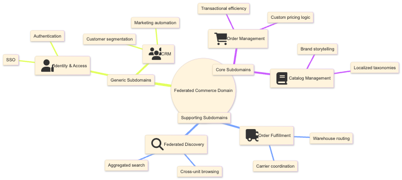

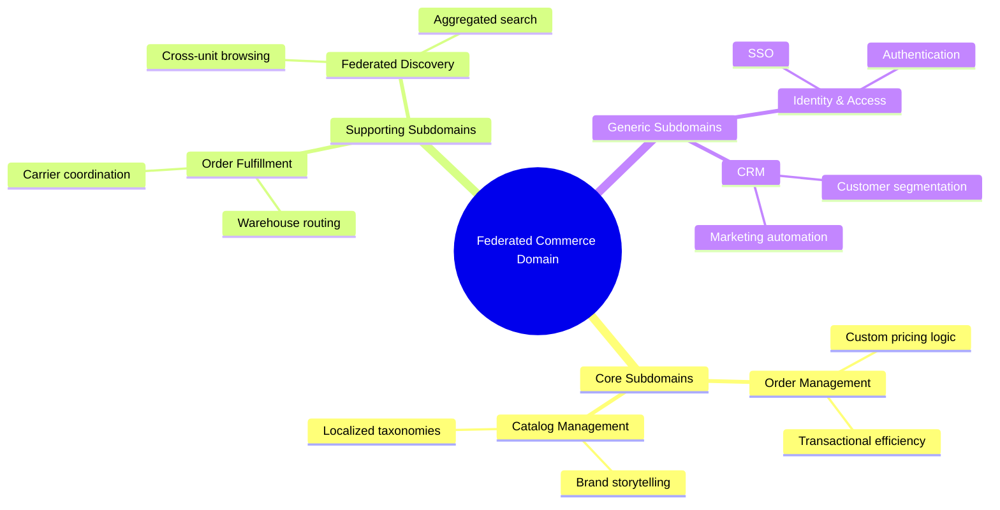

### 8.2. Bounded Contexts and Related Modules

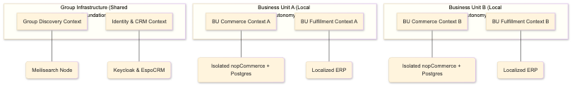

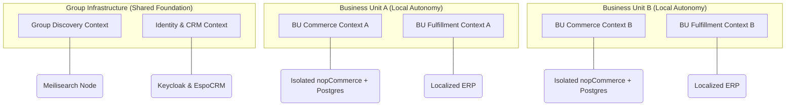

### 8.3. Modules and Event Driven Communication

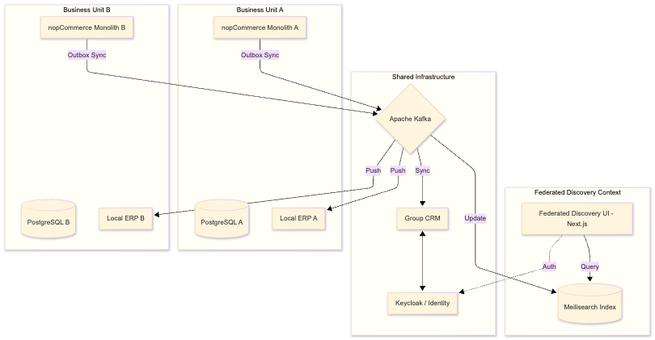

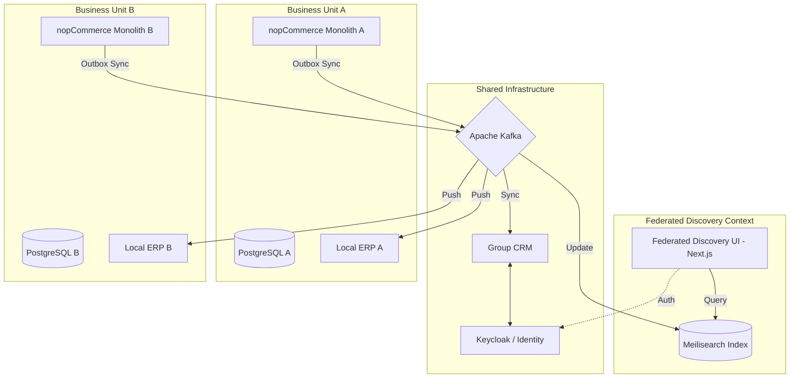

### 8.4. Context Map (OHS, PL, and ACL)

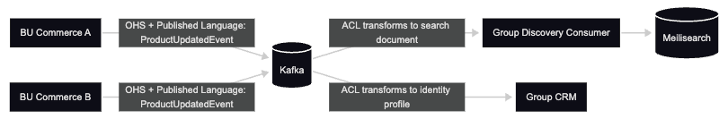

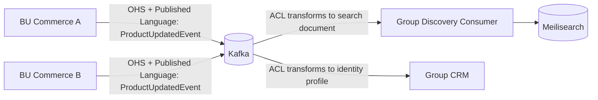

### 8.5. Order Flow

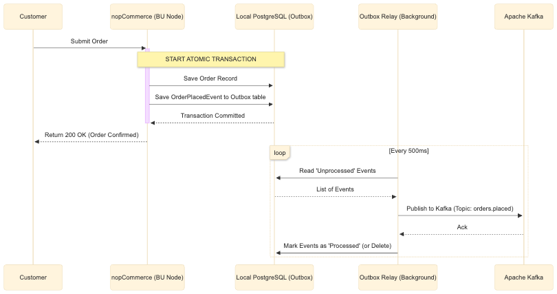

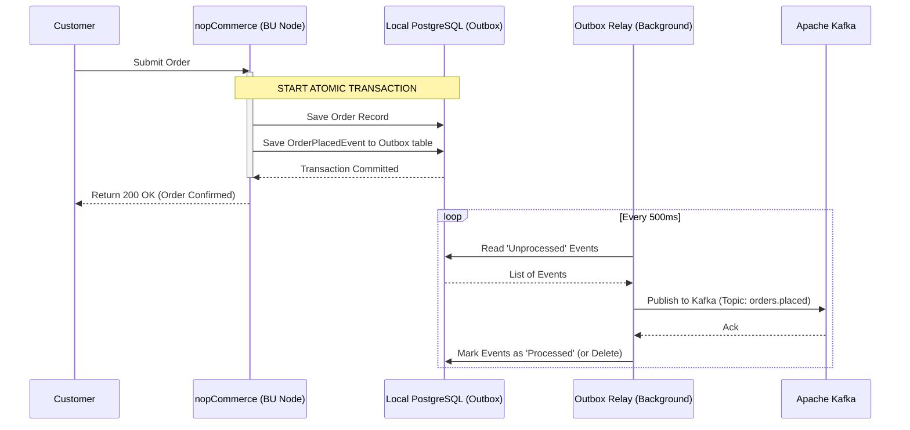

### 8.6. Shared Discovery Flow

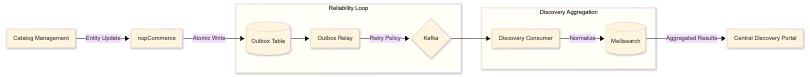

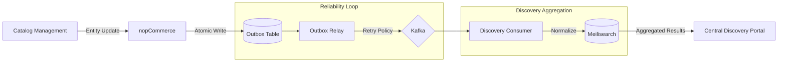

## 9. Conclusion

This architecture proposal satisfies the core scenario pressures by combining **local autonomy**, **fault containment**, and **shared enterprise capabilities** without forcing premature microservice decomposition.

The key design strength is a disciplined split between:
- **isolated transactional ownership** in BU-local nopCommerce deployments, and
- **asynchronous enterprise cohesion** through Kafka-backed outbox integration and centralized read models (Meilisearch, CRM, IAM).

The design explicitly accepts delayed consistency (up to 2 minutes for federated discovery updates) as a strategic trade-off for resilience and boundary protection. This trade-off is appropriate for the business scenario because local checkout continuity is prioritized over immediate cross-context synchronization.

In summary, the proposal remains faithful to DDD boundaries, avoids distributed-monolith coupling, and provides a practical modernization path from an existing modular monolith toward a federated enterprise platform.

## 10. References

1. [nopCommerce: Free and open-source eCommerce platform. ASP.NET Core based shopping cart.](https://www.nopcommerce.com/en)
2. [ASP.NET Core eCommerce software. nopCommerce is a free and open-source shopping cart. - GitHub](https://github.com/nopsolutions/nopcommerce)
3. [The Architecture behind the nopCommerce eCommerce Platform - Microsoft Learn](https://learn.microsoft.com/en-us/shows/on-dotnet/the-architecture-behind-the-nopcommerce-ecommerce-platform)
4. [Architecture of nopCommerce - nopCommerce Documentation](https://docs.nopcommerce.com/en/developer/tutorials/architecture-of-nopCommerce.html)
5. [Source Code Organization - nopCommerce Documentation](https://docs.nopcommerce.com/en/developer/tutorials/source-code-organization.html)
6. [Entity events system - nopCommerce Documentation](https://docs.nopcommerce.com/en/developer/design/entity-events-system.html)
7. [Multi-store eCommerce platform - nopCommerce](https://www.nopcommerce.com/en/multi-store-ecommerce)
8. [Composing Complex Systems with Domain-Driven Design - Salesforce](https://www.salesforce.com/blog/composing-complex-systems-domain-driven-design/)
9. [Bounded Context - Martin Fowler](https://martinfowler.com/bliki/BoundedContext.html)
10. [Understanding Domain-Driven Design (DDD) for Developers - Redis](https://redis.io/glossary/domain-driven-design-ddd/)
11. [What Is A Bounded Context? DDD Guide To Clear Boundaries](https://www.ituonline.com/tech-definitions/what-is-a-bounded-context/)
12. [Context Mapping in Domain-Driven Design | Shouldn't Be Hard - Code With Arho](https://www.arhohuttunen.com/domain-driven-design-context-mapping/)
13. [Monolith vs Microservices Decision Framework 2026 - AgileSoftLabs](https://www.agilesoftlabs.com/blog/2026/02/monolith-vs-microservices-decision)
14. [Microservices vs Modular Monolith in 2026: What Enterprises Are Choosing - ancient.global](https://www.ancient.global/en/blogs-ancient/microservices-vs-modular-monolith-2026)
15. [Outbox Pattern for Reliable Event Publishing - Conduktor](https://www.conduktor.io/glossary/outbox-pattern-for-reliable-event-publishing)
16. [Transactional outbox pattern - AWS Prescriptive Guidance](https://docs.aws.amazon.com/prescriptive-guidance/latest/cloud-design-patterns/transactional-outbox.html)
17. [Saga Orchestration for Microservices Using the Outbox Pattern - InfoQ](https://www.infoq.com/articles/saga-orchestration-outbox/)
18. [Order Management vs Order Fulfillment: Key Differences - Deck Commerce](https://www.deckcommerce.com/blog/order-management-vs-order-fulfillment-key-differences)
19. [Event-Driven Architecture | Platform Decision Guides - Salesforce Architects](https://architect.salesforce.com/docs/architect/decision-guides/guide/event-driven.html)
20. [Deep-dive article on nopCommerce architecture — written from 14+ years in the trenches](https://www.nopcommerce.com/en/boards/topic/103078/deep-dive-article-on-nopcommerce-architecture-written-from-14-years-in-the-trenches)
