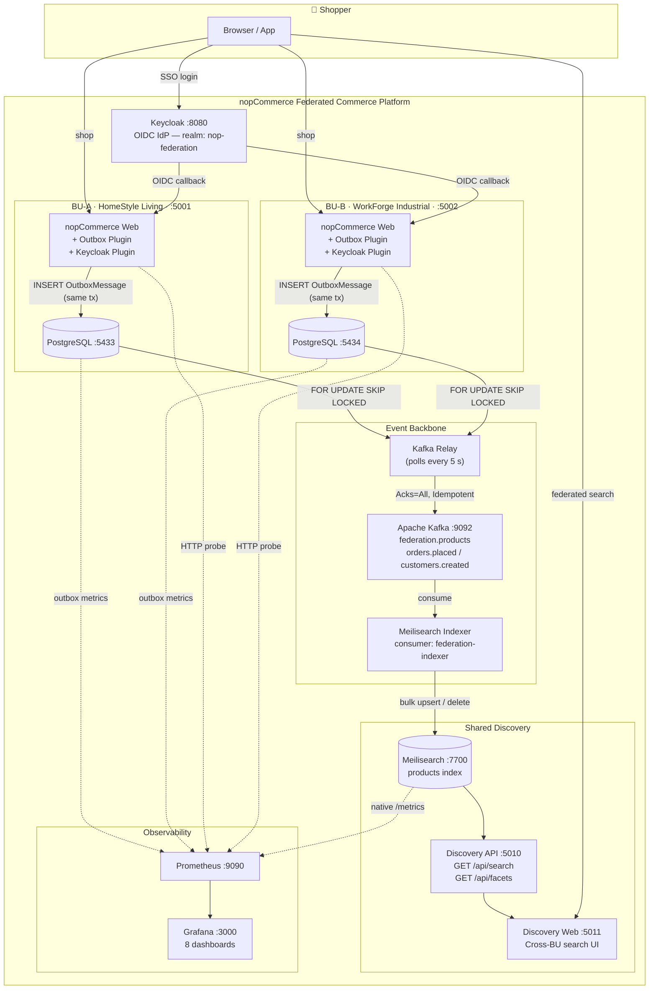
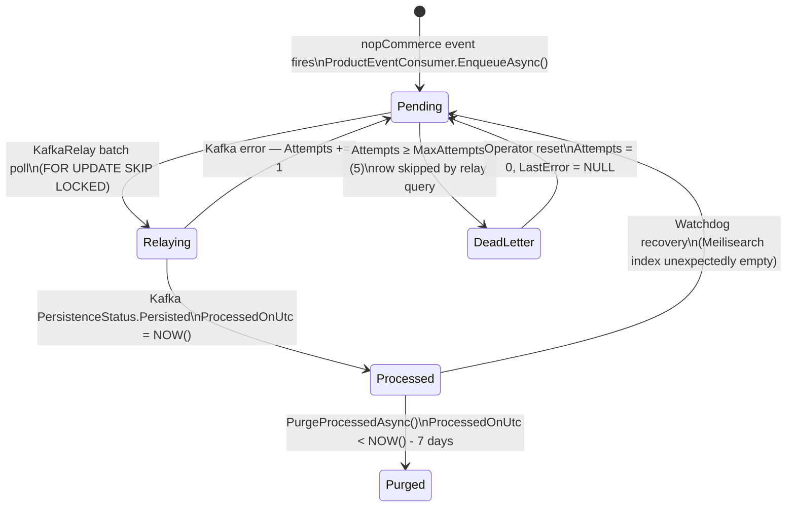
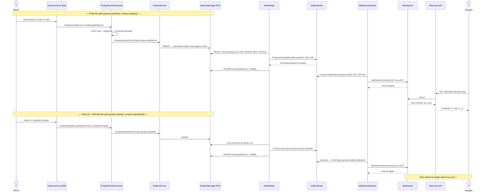
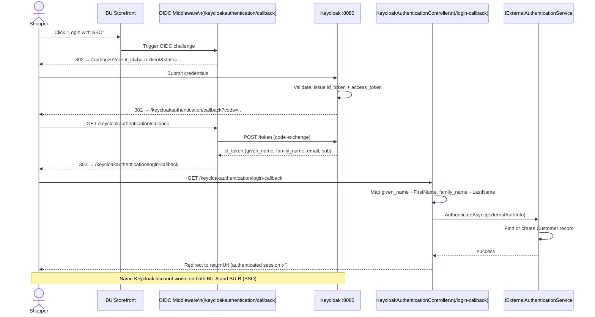
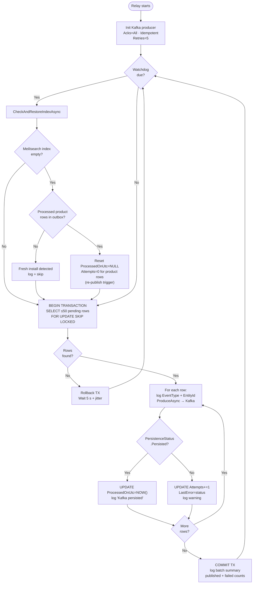
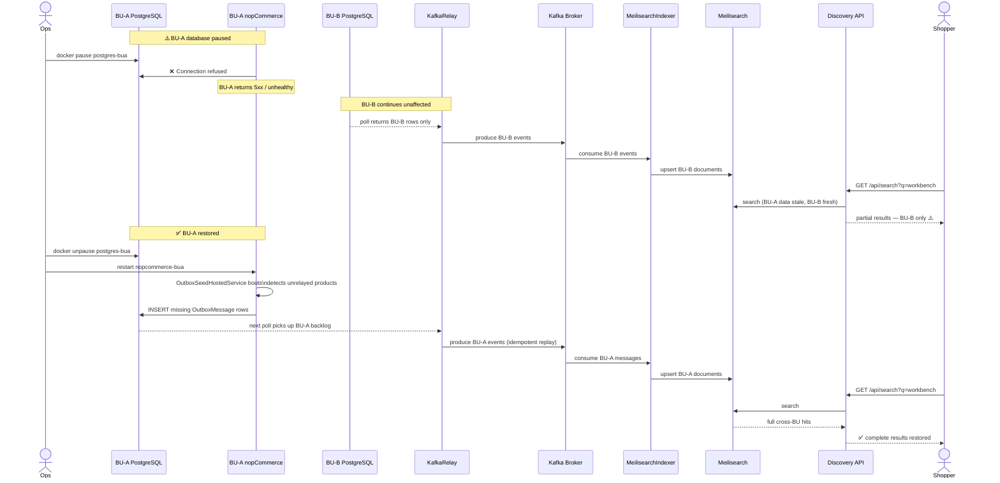
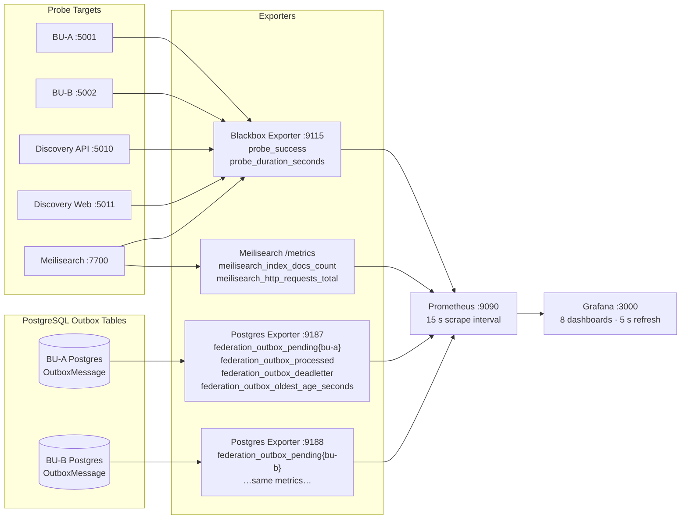
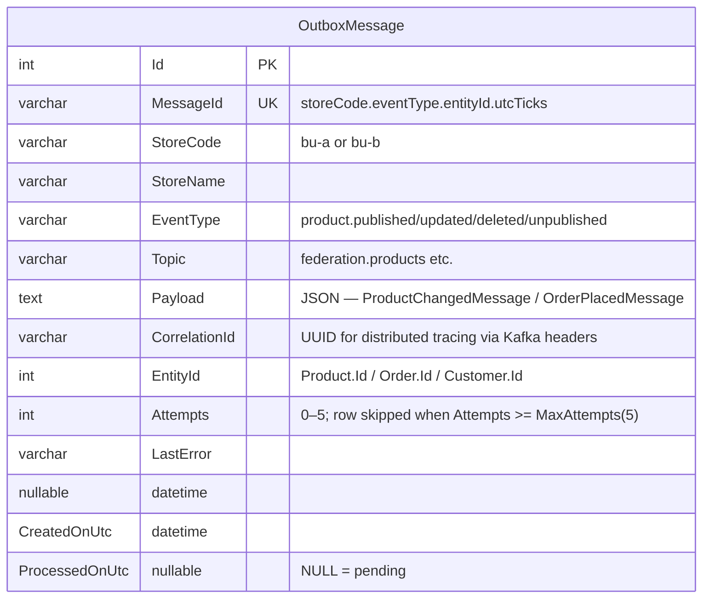
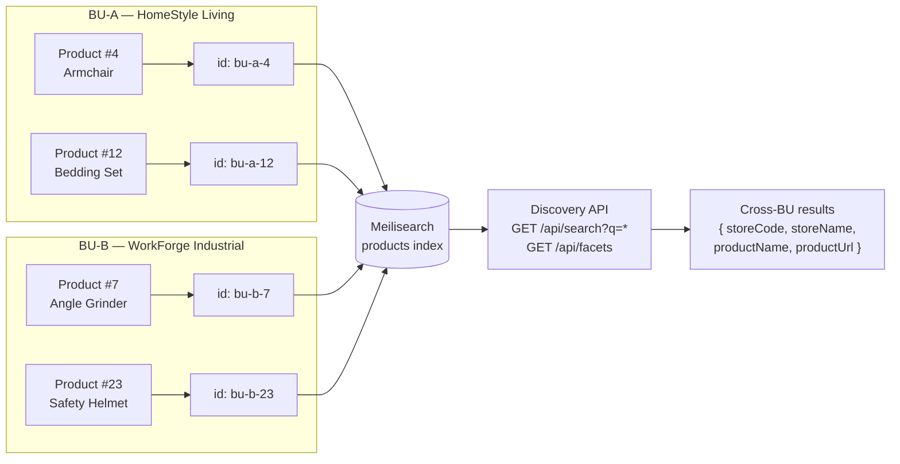

# Federation Platform — Architecture Diagrams

Last updated: 2026-06-03

All diagrams use [Mermaid](https://mermaid.js.org/) syntax and render natively on GitHub, GitLab, and most modern Markdown viewers.

---

## 1 · System Context (C4 Level 1)

---

## 2 · Transactional Outbox — Message State Machine

---

## 3 · Product Lifecycle — Publish & Delete Flow

---

## 4 · SSO Login Flow (Keycloak OIDC)

---

## 5 · Kafka Relay — Reliability Loop

---

## 6 · Degraded BU Scenario + Automatic Recovery

---

## 7 · Observability Stack

---

## 8 · OutboxMessage Schema

---

## 9 · Meilisearch Document ID Addressing

> **Isolation guarantee:** `DeleteDocumentsAsync(["bu-b-23"])` only removes BU-B's product 23.  
> BU-A documents can never be accidentally deleted by a BU-B event.

---

*Last updated: 2026-06-03*
